# Teyvat — Википедия

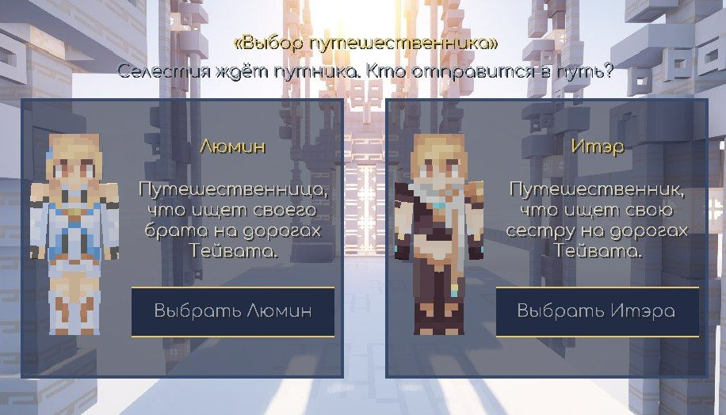
*Выбор Путешественника перед первым входом в мир.*

## Содержание

1. [Мир](#мир)
   - [Пляж](#пляж)
   - [Драконий Хребет](#драконий-хребет)
   - [Точка телепортации](#точка-телепортации)
2. [Битва](#битва)
   - [Удары](#удары)
   - [Комбо](#комбо)
   - [Заряженная атака](#заряженная-атака)
   - [Тупой меч](#тупой-меч)
   - [Рывок](#рывок)
   - [Гидро слайм](#гидро-слайм)
   - [Урон от падения](#урон-от-падения)
3. [Предметы](#предметы)
   - [Мора](#мора)
   - [Слизь слайма](#слизь-слайма)
4. [Приключения](#приключения)
   - [Бег и выносливость](#бег-и-выносливость)
   - [Приближение и отдаление](#приближение-и-отдаление)
   - [Клавиша C](#клавиша-c)
   - [Опыт и Ранг Приключений](#опыт-и-ранг-приключений)
   - [Мировые задания](#мировые-задания)
5. [Карта путешественника](#карта-путешественника)
6. [Паймон](#паймон)
7. [Клавиши управления](#клавиши-управления)
8. [Подбор предметов](#подбор-предметов)

---

# Мир

## Пляж

Первоначальная локация — это пляж Звездопадочной долины в регионе Мондштадт. Именно отсюда Путешественник впервые отправляется в путь.

Пляж представляет собой полосу песка между морем и равнинами Тейвата. Здесь игрок появляется после выбора героя, здесь же Паймон проводит первое знакомство с миром. Границы пляжа строго контролируются системой: во время обучения игрок не может покинуть пляж, пока не завершит все задания Паймон.

## Драконий Хребет

Драконий Хребет окружает пляж природным кольцом и служит переходом от берега к открытому миру. Со стороны моря кольцо раскрывается, поэтому вода и линия горизонта остаются открытыми; с суши хребет образует высокие травяные холмы, скальные склоны и каменистые выступы.

Через хребет проходит широкая тропа-серпантин. Она начинается у телепортационной точки за пляжем, поднимается плавными поворотами между холмами и приводит на смотровую вершину. Тропа выровнена рельефом, поэтому маршрут остаётся проходимым без скачков по крутым уступам.

Вершина работает как естественная смотровая площадка: с неё открывается вид назад, к морю и пляжу, а также вперёд, на равнины Тейвата. Склоны сочетают зелёный покров, coarse dirt, гравийные осыпи и открытый камень. На высоте и на крутых гранях преобладает камень, а пологие участки остаются травяными. Деревья и цветы встречаются преимущественно по склонам и возле тропы.

На карте путешественника сам хребет отображается приглушённым горно-зелёным цветом, а тропа — более тёплой земляной полосой. Это позволяет отличать маршрут от обычных равнин и ориентироваться во время первого выхода из пляжной локации.

## Точка телепортации

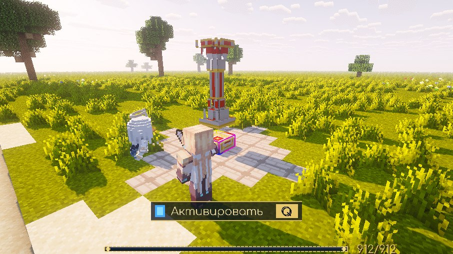
*Неактивированная точка телепортации с красной плитой и красной колонной.*

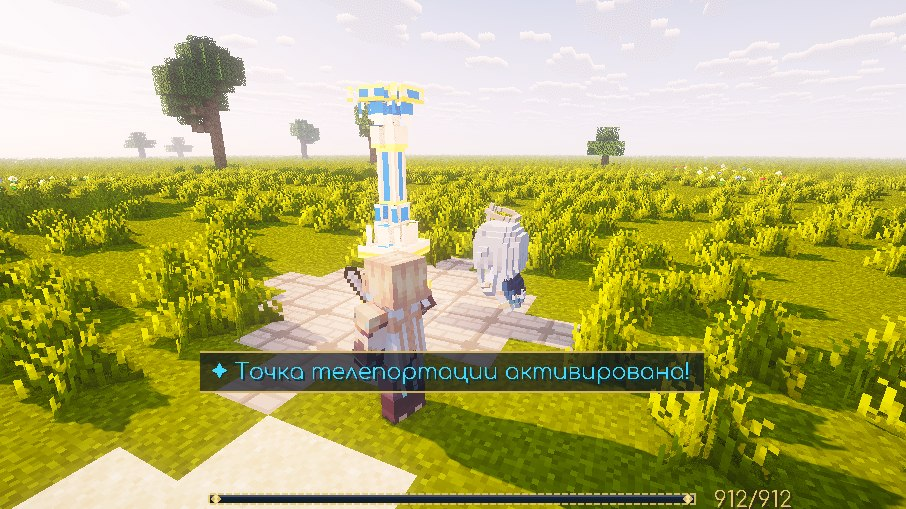
*Активированная точка телепортации с синей плитой и синей колонной.*

Точки телепортации — это структуры, расположенные по всему Тейвату. После активации они позволяют мгновенно перемещаться к ним.

Жители континента относятся к ним как к диковинам древности и потеряли всю надежду понять, как работают эти механизмы. Однако для Путешественника их предназначение очевидно.

Активируя новые точки телепортации, путешественник получает **50 единиц опыта приключений**, который помогает ему становиться сильнее.

### Активация

Чтобы активировать точку телепортации, подойдите к ней на расстояние до 5 блоков и нажмите **Q**. Неактивированная точка имеет красную плиту; после активации она становится синей. Активация сопровождается вспышкой света и частицами.

Каждый игрок видит свою собственную картину активации: если один игрок активировал точку, другой будет видеть её всё ещё красной до собственной активации.

---

# Битва

## Удары

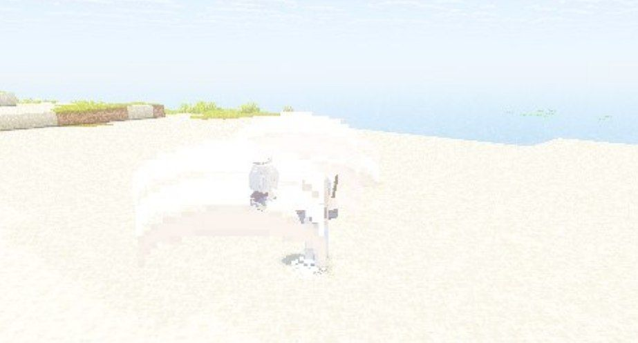
*Боевая серия одноручного меча.*

Каждый удар имеет свою траекторию и силу:

| Удар | Урон (% ATK) | Траектория |
|------|-------------|------------|
| 1-й | 44.5% | Слева направо |
| 2-й | 43.4% | Апперкот снизу вверх |
| 3-й | 53.0% | Разворот 360°, широкий круг |
| 4-й | 58.3% | Справа налево |
| 5-й | 70.8% | Мощный прокат, самый сильный |

**Хит-стоп**: на каждом ударе кадр замирает на несколько тиков, создавая ощущение веса удара.

**Кнокбек**: 5-й удар отбрасывает цель дальше обычного.

### Различия Путешественников

| Персонаж | Преимущества |
|----------|--------------|
| Люмин | Обычные атаки исполняются быстрее; заряженная атака наносит на **11,5%** больше урона. |
| Итэр | Мужская средняя модель дает небольшое преимущество в беге, спринте, плавании и ряде бытовых действий. Лазание пока не реализовано: его параметр зарезервирован. |

## Комбо

ЛКМ — каждый клик наносит следующий удар в серии. Серия идёт от 1-го до 5-го удара. После 5-го удара — пауза (~1 секунда), затем серия начинается заново.

Во время атаки движение заблокировано: герой двигается только микро-рывком по направлению атаки. Прыжок прерывает серию.

Если между кликами проходит более ~1 секунды, серия сбрасывается и начинается с 1-го удара.

## Заряженная атака

Удерживайте ЛКМ более 0.5 секунды после удара, чтобы начать накопление заряда.

**Заряд**: вокруг тела героя появляется вихрь искр. Максимальная длительность заряда — 3 секунды. Во время заряда движение заблокировано. Сила вихря визуально зависит от длительности заряда.

**Выпуск**: при отпускании ЛКМ герой выполняет широкий диагональный серп + взрыв искр. Это мощный удар по области вокруг героя (360°). Урон зависит от уровня заряда: чем дольше заряд, тем сильнее удар.

Заряженная атака расходует выносливость и сбрасывает серию комбо.

## Рывок

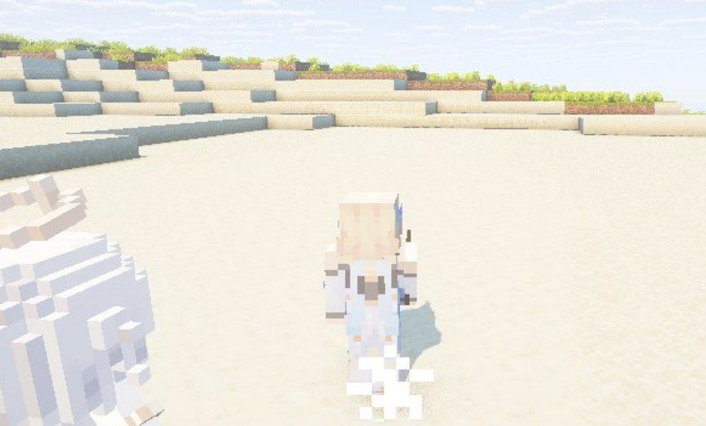
*Боевой рывок с наклоном корпуса.*

Рывок — короткий бросок вперёд с наклоном тела, как в бою. Выполняется нажатием **Left Ctrl**.

Рывок стоит дороже бега по выносливости. Если дуга выносливости пуста, рывок не начнётся — сначала восстановите её.

## Урон от падения

Первые ~7 блоков падения безопасны. Дальше урон растёт быстро и становится смертельным.

Вода отменяет урон от падения — выбирайте путь с обрыва через воду.

---

# Оружие

## Тупой меч

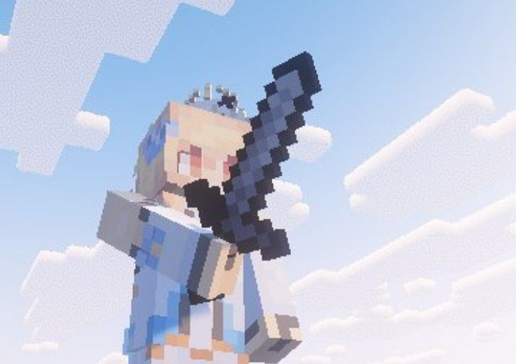
*Стартовый одноручный меч в руке героя.*

Тупой меч — простой, потёртый клинок, верный спутник Путешественника.

| Характеристика | Значение |
|---------------|----------|
| Редкость | ★☆☆☆☆ |
| Тип | Одноручное оружие |
| Base ATK | 23 |
| Получение | Выдаётся при входе в мир (слот 0) |

Лезвие — тёмно-серое, слегка затупленное. Рукоять обмотана кожаным шнуром.

> «Молодые мечты и восторг от приключений. Если этого мало — компенсируй смелостью.»

---

# Противники

## Гидро слайм

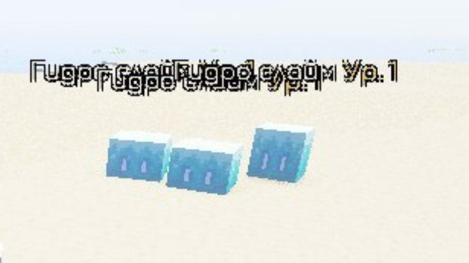
*Гидро слаймы в прибрежной зоне.*

Небольшой монстр, созданный из скопления Гидро элемента, который рассеян по всему миру.

Если верить легендам, раньше Гидро слаймов использовали в качестве экстренного источника воды при долгих путешествиях по засушливым местам или глубоким подземельям.

Однако из-за высокого содержания Гидро элемента в этих слаймах прямое применение этих созданий в пищу приведёт к плачевным последствиям.

---

# Предметы

## Мора

Мора — это основная денежная единица, которая используется для покупки различных предметов.

Валюта, принимаемая во всём мире Тейват. Никто не оспаривает её ценность и статус.

Выпадает с побеждённых врагов и может быть найдена в мире.

## Слизь слайма

Слизь слайма — материал улучшения персонажей и оружия, выпадающий со слаймов.

Используется для крафта и прокачки. Выпадает с гидро слаймов любого уровня.

---

# Приключения

## Бег и выносливость

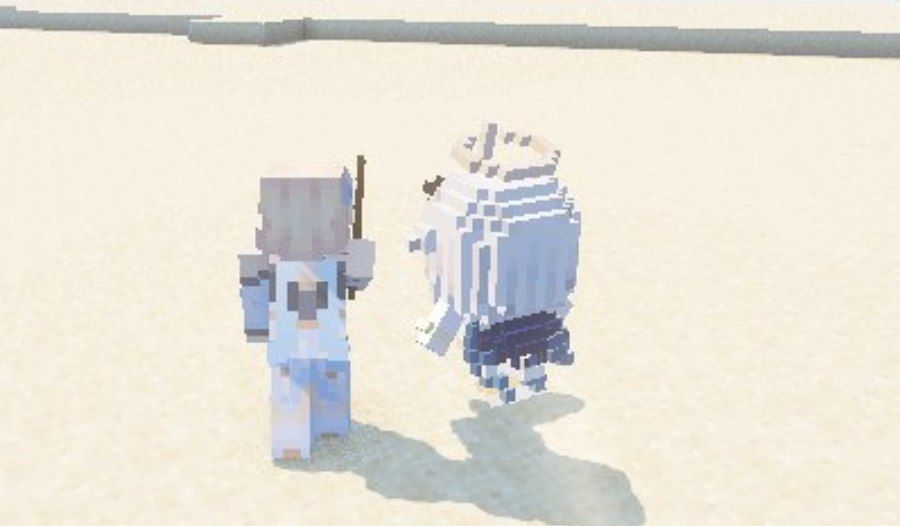
*Дуга выносливости во время бега.*

Бег начинается с двойного нажатия **W** и тянет выносливость — дугу в левом нижнем углу экрана.

Когда дуга пустеет, бег обрывается. Дайте ей набраться: двойное нажатие W, пока она не полна, не сработает.

Выносливость возвращается сама, когда герой стоит или идёт шагом.

## Приближение и отдаление

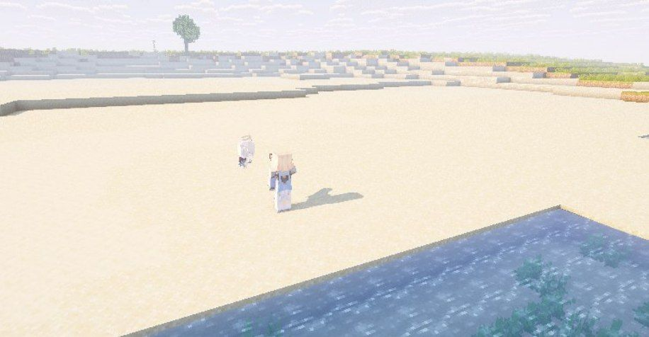
*Осмотр местности через приближение камеры.*

Колесо мыши приближает взгляд к миру, как подзорная труба, и отдаляет обратно. Предмет в руке не нужен.

Осматривайте дальние обрывы и долины: за холмом может прятаться лагерь или стадо гидро слаймов.

## Клавиша C

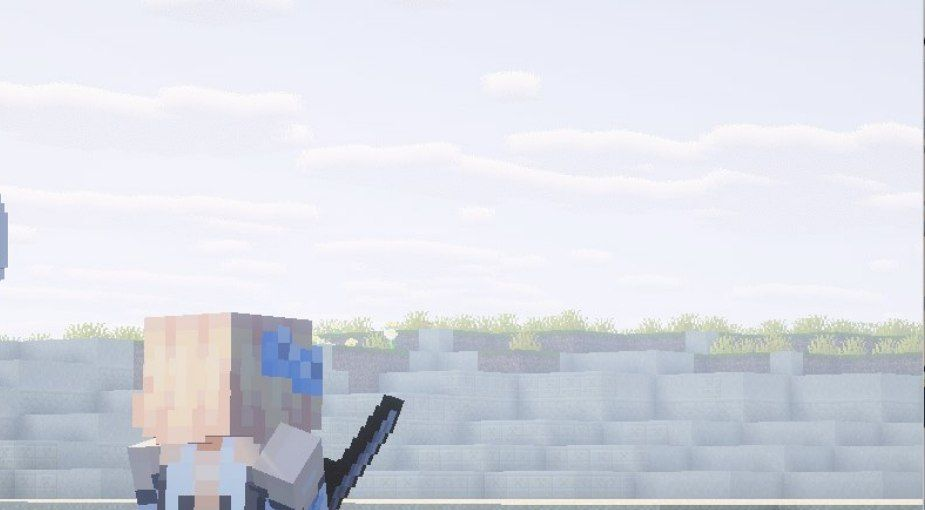
*Приближение камеры к земле при зажатой C.*

Зажмите **C** — камера плавно плывёт к земле и разглядывает местность вблизи. Отпустите — взгляд вернётся.

Удобно прицеливаться в брызги слайма и искать тропу среди скал.

## Опыт и Ранг Приключений

Опыт приключений даётся за:
- Победы над врагами;
- Выполненные задания;
- Активацию точек телепортации.

При накоплении достаточного количества опыта Ранг Приключений повышается. Более высокий ранг открывает новые возможности в мире.

## Мировые задания

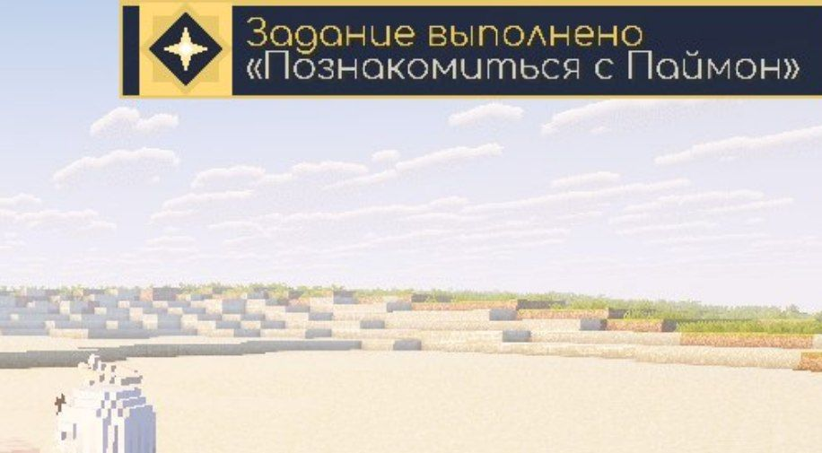
*Трекер мирового задания на экране.*

Задания рождаются в пути. Паймон подскажет, куда ступить, а мир ответит историей — наградой станут опыт и мора.

Следите за углом экрана: объявленное задание держится там, пока не выполнено. Золотой ромб с искрой возвещает о награде.

Нажмите **X**, чтобы пропустить обучение полностью.

---

# Карта путешественника

### Возможности

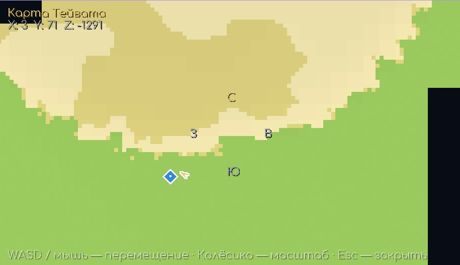
*Полноэкранная карта с исследованной территорией, стрелкой игрока и значком активированной точки телепортации.*

Полноэкранная карта открывается клавишей **M** и показывает только те чанки, которые игрок уже исследовал. Карта не привязана к границам одного экрана: видимость перемещается по миру, а маркеры остаются закреплёнными за своими мировыми координатами.

- **Детализация**: один пиксель карты соответствует одному блоку мира при базовом масштабе;
- **Биомы и поверхность**: пляж, Драконий Хребет, серпантин, равнины, лес, камень, снег и другие поверхности различаются цветом;
- **Вода**: вся открытая вода отображается одинаковым тёмно-синим цветом (`#1A3D7A`) независимо от глубины;
- **Высота**: суша затеняется относительно уровня моря — возвышенности светлее, низины темнее;
- **Активированные точки телепортации**: синий ромб радиусом 7 пикселей с белой обводкой и белым ядром;
- **Позиция игрока**: компактная золотая стрелка радиусом 5 пикселей с белой обводкой, направленная по взгляду;
- **Компас**: статичные обозначения сторон света (С/Ю/З/В).

### Исследование территории

Новая карта начинается тёмной. Клиент проверяет чанки вокруг игрока на каждом игровом тике и отмечает загруженные чанки в квадрате **5×5** — то есть в радиусе двух чанков от текущего чанка игрока. Поэтому территория раскрывается во время движения, а не мгновенно на весь экран.

Новые исследованные чанки периодически отправляются на сервер и сохраняются в тегах игрока в формате `teyvat:map_<chunkX>_<chunkZ>`. При повторном входе сервер синхронизирует этот список обратно, поэтому исследование не сбрасывается.

### Оптимизация и отрисовка

Каждый исследованный чанк пре-рендерится в массив из 256 цветов размером 16×16. Цвет определяется по верхней поверхности (`WORLD_SURFACE`) и состоянию жидкости в найденной точке: если там есть вода, рисуется единый цвет океана, иначе выбирается цвет блока и биома. Запросы к миру не выполняются при обычной перерисовке уже готового чанка.

При масштабе от 2× и выше рисуются отдельные блоки чанка. При более мелком масштабе используется усреднённый цвет чанка, поэтому удалённые области остаются читаемыми без лишней нагрузки. Кэш обновляется при переходе игрока в другой чанк и периодически во время открытой карты, чтобы изменения мира попадали на карту.

### Управление

| Действие | Управление |
|----------|-----------|
| Перемещение камеры | WASD / перетаскивание мышью |
| Масштаб | Колесо мыши (0.25×–4×) |
| Закрыть | M / Esc |

Неисследованные области остаются почти чёрными. Значки телепортации и стрелка игрока не «приклеиваются» к экрану: при перетаскивании карты они смещаются вместе с биомами и структурой, сохраняя своё положение в мире.

---

# Паймон

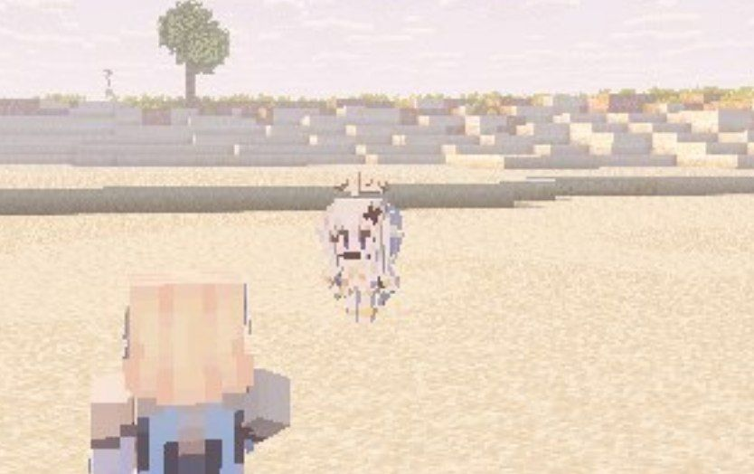
*Паймон сопровождает Путешественника и ведёт обучение.*

Паймон — спутница Путешественника и проводник по миру Тейвата. Она появляется после выбора героя и всегда следует за спиной, паря справа.

Паймон проводит обучение через серию диалогов и мини-уроков. После завершения всех заданий она остаётся рядом как компаньон.

Подсказка клавиши отображается внизу экрана при приближении к интерактивным объектам (например, к точке телепортации — подсказка **Q**).

---

## Клавиши управления

| Клавиша | Действие |
|---------|---------|
| **W A S D** | Движение |
| **W ×2** | Бег (тратит выносливость) |
| **Left Ctrl** | Рывок |
| **Space** | Прыжок (прерывает атаку) |
| **ЛКМ** | Атака / начало заряда |
| **ЛКМ (удержание)** | Заряженная атака |
| **F** | Подбор предмета |
| **Q** | Активация точки телепортации |
| **C** | Осмотр местности (удержание) |
| **N** | Открыть [WIKI.md](https://github.com/inzexg-coder/Genshin-MC-IRIS/blob/main/WIKI.md) в браузере |
| **M** | Карта путешественника |
| **X** | Пропуск обучения |
| **Колесо мыши** | Приближение / отдаление камеры |
| **V** | Свободная камера |

---

# Подбор предметов

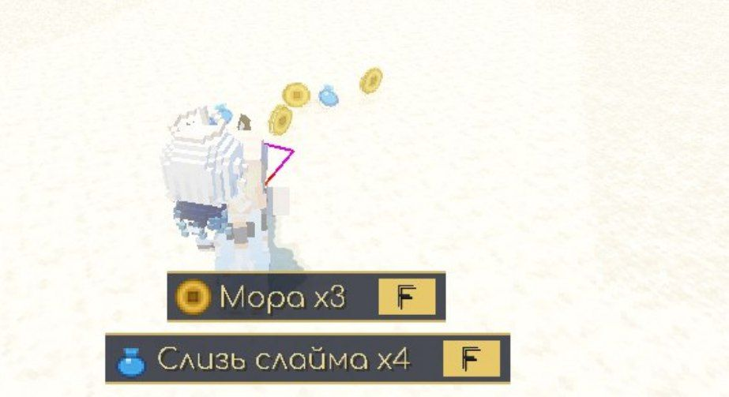
*Подсказка подбора ближайшего предмета.*

Автоподбор отключён. Добыча не попадает в инвентарь при прохождении мимо.

Чтобы подобрать предмет:
1. Подойдите к лежащему предмету на расстояние ~3 блоков;
2. Внизу экрана появятся вкладки с ближайшими предметами;
3. Нажмите **F** для подбора ближайшего;
4. Удерживайте **F** для быстрого подбора нескольких предметов подряд.

Предметы никогда не попадают в выбранный слот хотбара (руку). Инвентарь заполняется начиная со второго слота.
